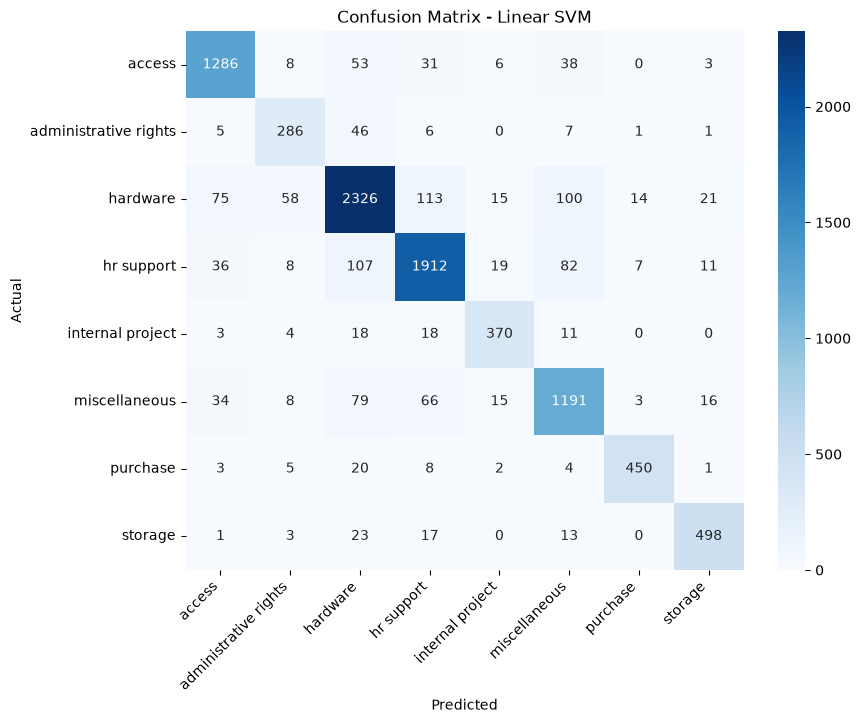

# IT Ticket Classifier

Machine learning model that reads an IT support ticket and predicts its category, to automate ticket routing in a service desk.

## Problem
Service desks receive thousands of tickets daily. Manual sorting is slow and error-prone, and wrongly routed tickets delay resolution.

## Dataset
IT Service Ticket Classification Dataset (Kaggle), 8 categories. The text was already preprocessed (lowercased, stopwords removed, lemmatized).


| Item | Value |
|:--|--:|
| Total tickets (after cleaning) | 47,823 |
| Train / Test split | 38,258 / 9,565 (80/20, stratified) |
| Categories | 8 |
| TF-IDF features | 20,000 |
| Avg. words per ticket | 43.6 |

| Category | Share of data |
|:--|--:|
| hardware | 28.5% |
| hr support | 22.8% |
| access | 14.9% |
| miscellaneous | 14.8% |
| storage | 5.8% |
| purchase | 5.2% |
| internal project | 4.4% |
| administrative rights | 3.7% |

Classes are imbalanced (about 7.7x between the largest and smallest), so macro F1 and `class_weight="balanced"` were used.

## Approach
1. Removed missing values, duplicates and tickets shorter than 3 words
2. Stratified 80/20 train-test split
3. TF-IDF features (unigrams + bigrams, 20,000 features, min_df=3), fitted on the training set only
4. Compared three models (`class_weight="balanced"` where supported)
5. Evaluated with accuracy, precision, recall, F1, classification report and confusion matrix
6. Built a Streamlit app for live predictions

## Results

| Model | Accuracy | Precision (macro) | Recall (macro) | Weighted F1 | Macro F1 |
|:--|--:|--:|--:|--:|--:|
| **Linear SVM** | **0.870** | 0.867 | 0.871 | **0.870** | **0.869** |
| Logistic Regression | 0.864 | 0.846 | 0.884 | 0.865 | 0.862 |
| Naive Bayes | 0.780 | 0.879 | 0.680 | 0.774 | 0.733 |

Linear SVM gave the best balance of precision and recall. Naive Bayes had high precision but low recall, meaning it missed many tickets from the smaller classes.

### Per-class results (Linear SVM)

| Category | Precision | Recall | F1-score | Support |
|:--|--:|--:|--:|--:|
| access | 0.891 | 0.902 | 0.897 | 1425 |
| administrative rights | 0.753 | 0.812 | 0.781 | 352 |
| hardware | 0.871 | 0.855 | 0.862 | 2722 |
| hr support | 0.881 | 0.876 | 0.878 | 2182 |
| internal project | 0.867 | 0.873 | 0.870 | 424 |
| miscellaneous | 0.824 | 0.843 | 0.833 | 1412 |
| purchase | 0.947 | 0.913 | 0.930 | 493 |
| storage | 0.904 | 0.897 | 0.901 | 555 |
| **macro avg** | 0.867 | 0.871 | 0.869 | 9565 |
| **weighted avg** | 0.870 | 0.870 | 0.870 | 9565 |



## Error analysis

Top misclassifications on the test set:

| Actual | Predicted | Count |
|:--|:--|--:|
| hardware | hr support | 113 |
| hr support | hardware | 107 |
| hardware | miscellaneous | 100 |
| hr support | miscellaneous | 82 |
| miscellaneous | hardware | 79 |
| hardware | access | 75 |
| miscellaneous | hr support | 66 |
| hardware | administrative rights | 58 |

- Most errors are among hardware, hr support and miscellaneous, whose descriptions share similar vocabulary. Miscellaneous is a catch-all category, so it is inherently ambiguous.
- Administrative rights is the weakest class (F1 0.781) and also the smallest. Its precision (0.753) is lower than its recall (0.812); 58 hardware tickets were predicted as administrative rights.
- Many tickets follow fixed templates (e.g. "new purchase po ..."), which the model learns easily (purchase F1 0.930). Errors mostly come from short or ambiguous tickets with no category-specific keywords.

## Limitations
- The dataset text is preprocessed, so performance on raw, natural sentences was not tested.
- Training tickets average about 44 words, so very short inputs (under ~10 words) may be misclassified.
- Misclassification analysis is based on the top confusion pairs only.

## Performance
Linear SVM inference (excluding TF-IDF vectorization): 9,565 tickets in 0.021 sec. Saved model files are small (model 1.28 MB, TF-IDF 0.82 MB).

## Demo


## How to run
```
pip install -r requirements.txt
streamlit run app.py
```

## Tech stack
Python, Pandas, Scikit-learn, Matplotlib, Seaborn, Streamlit

## Future improvements
- Sentence embeddings or DistilBERT for better context understanding
- Voting ensemble of the three models
- Priority prediction
- Merge or review the ambiguous "miscellaneous" category
